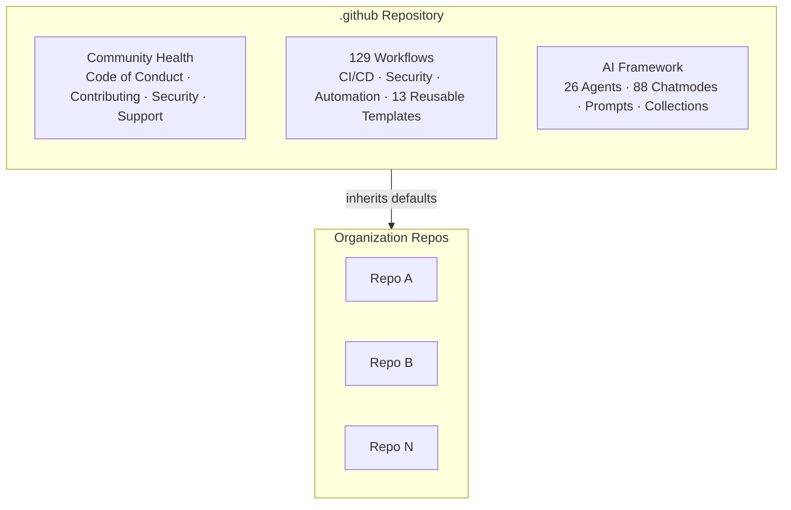

<div align="center">

# .github

<!-- DEMO:START -->

[](https://codespaces.new/organvm/dot-github--theoria?ref=main)

<!-- DEMO:END -->

**Organization-wide infrastructure for CI/CD, AI agents, and community health**

<!-- BADGES:START -->

[](https://github.com/organvm-i-theoria/.github/actions/workflows/ci.yml)
[](pyproject.toml)
[](pyproject.toml)
[](LICENSE)
[](https://github.com/pre-commit/pre-commit)
[](CONTRIBUTING.md)

<!-- BADGES:END -->

[](https://codespaces.new/organvm-i-theoria/.github?devcontainer_path=.devcontainer/devcontainer.json)

[Documentation](docs/INDEX.md) | [Contributing](CONTRIBUTING.md) |
[Security](SECURITY.md)

</div>

## Contents

- [Why This Repository?](#why-this-repository)
- [Quick Start](#quick-start)
- [Workflows](#workflows)
- [AI Framework](#ai-framework)
- [Organization Governance](#organization-governance)
- [Documentation](#documentation)
- [Contributing](#contributing)
- [Security](#security)
- [Acknowledgments](#acknowledgments)
- [License](#license)

This is the **organization-level `.github` repository** for organvm-i-theoria.
Files here — workflows, templates, governance docs — are automatically inherited
by every repository in the organization that doesn't define its own.

<!-- UPDATE_COUNTS: auto-generated by setup_template.py -->

## Why This Repository?

Managing organization-wide standards across dozens of repositories is tedious
and error-prone. This `.github` repo solves that by providing a single source of
truth — workflows, templates, governance docs, and AI configurations that every
org repo inherits automatically. Change it once here, and every repository
benefits.

<!-- Accessible description: Architecture diagram showing the .github repository
providing Community Health files, Workflows, and AI Framework to all org repos -->



## Quick Start

```bash
git clone https://github.com/organvm-i-theoria/.github.git
cd .github
pip install -e ".[dev]"
pre-commit install
```

Need help? Check [SUPPORT.md](SUPPORT.md) or
[start a discussion](https://github.com/orgs/organvm-i-theoria/discussions).

## Workflows

**129 workflows** covering CI/CD pipelines, security scanning (CodeQL, Gitleaks,
TruffleHog), PR automation, health monitoring, and metrics. All actions are
[SHA-pinned](https://docs.github.com/en/actions/security-for-github-actions/security-guides/security-hardening-for-github-actions#using-third-party-actions)
with ratchet comments.

Key workflows: `ci.yml` · `codeql-analysis.yml` · `auto-merge.yml` ·
`health-check.yml` · `batch-onboarding.yml` · `demo-deployment.yml`

See the [Workflow Registry](docs/registry/) for the full catalog.

## AI Framework

**26 production agents** across security, infrastructure, development,
languages, and documentation. **88 chatmodes** for specialized AI personas. Plus
coding instructions, task prompts, and curated collections — all compatible with
GitHub Copilot.

- [Agent Registry](docs/reference/AGENT_REGISTRY.md)
- [Copilot Quick Start](docs/guides/COPILOT_QUICK_START.md)

## Organization Governance

Default community health files inherited by all org repos:

| File                                       | Purpose                              |
| ------------------------------------------ | ------------------------------------ |
| [CODE_OF_CONDUCT.md](CODE_OF_CONDUCT.md)   | Community standards                  |
| [CONTRIBUTING.md](CONTRIBUTING.md)         | Contribution guidelines              |
| [SECURITY.md](SECURITY.md)                 | Vulnerability reporting              |
| [SUPPORT.md](SUPPORT.md)                   | Getting help                         |
| [README_STANDARDS.md](README_STANDARDS.md) | README structure and depth standards |

Issue templates, PR templates, and workflow templates are also provided for
bootstrapping new repositories.

## Documentation

| Resource                                                                | Description            |
| ----------------------------------------------------------------------- | ---------------------- |
| [Documentation Index](docs/INDEX.md)                                    | Browse all docs        |
| [Development Environment](docs/guides/DEVELOPMENT_ENVIRONMENT_SETUP.md) | Setup guide            |
| [Workflow Design](docs/workflows/WORKFLOW_DESIGN.md)                    | Architecture           |
| [Claude Code Guide](docs/guides/CLAUDE.md)                              | AI assistant reference |

## Contributing

We welcome contributions. Please read [CONTRIBUTING.md](CONTRIBUTING.md) for
guidelines, including our
[conventional commit](https://www.conventionalcommits.org/) requirement
(`type(scope): subject`).

## Security

Found a vulnerability? **Do not open a public issue.** Follow our
[Security Policy](SECURITY.md) or use
[GitHub Security Advisories](https://github.com/organvm-i-theoria/.github/security/advisories/new).

## Acknowledgments

- GitHub Copilot customizations adapted from
  [github/awesome-copilot](https://github.com/github/awesome-copilot)
- Workflow SHA-pinning via [ratchet](https://github.com/sethvargo/ratchet)

## License

[MIT](LICENSE)
